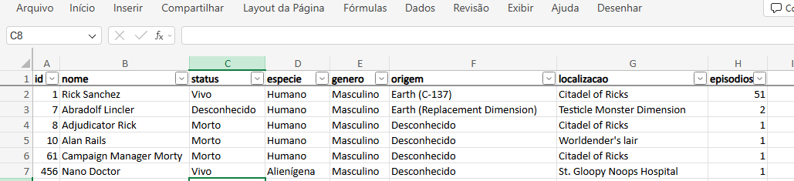

Rick and Morty Data Automation (API to Excel)
Descrição:
Este projeto automatiza a extração, tradução e formatação de dados da API do Rick and Morty. Ele consome informações de personagens, realiza o tratamento dos dados (incluindo a tradução de termos técnicos para o português) e gera um relatório profissional em Excel com formatação automática.

O objetivo foi aplicar conceitos de Arquitetura Limpa e Modularização, garantindo que cada parte do sistema (API, Regras de Negócio e Saída de Dados) seja independente e fácil de testar.Estou começando agora e aprendi como estuturar um modelo base de consumir API,  entao adaptei esse modelo base a API publica do rick e morty. O objetivo como um todo e aperfeiçoar as tecnicas e logica de progamação alem de tecnicas modernas para ingressar no mercado de trabalho.

Diferenciais Técnicos
Consumo Inteligente de API: Uso de requests.Session() no APIClient para reutilizar conexões HTTP, tornando as requisições mais rápidas e eficientes.

Tratamento e Tradução: O personagem_service.py atua como um adaptador, transformando o JSON bruto da API em um formato amigável, traduzindo categorias como status, gênero e espécies. A conexao é feita aqui para nao espalhar links de API pelo projeto.

Excel Profissional: O relatório não é apenas uma tabela bruta. O excel_service.py utiliza a biblioteca openpyxl para:

Auto-ajustar a largura das colunas conforme o conteúdo.

Aplicar filtros automáticos no cabeçalho.

Congelar a primeira linha para facilitar a leitura de grandes volumes de dados.

Estilizar o cabeçalho em negrito.

Prints Da Execução:

📂 Estrutura do Projeto
Plaintext
├── api/
│   └── client.py             # Cliente HTTP customizado com Session e Timeout
├── services/
│   ├── excel_service.py      # Lógica de geração e estilização do Excel
│   └── personagem_service.py # Regras de negócio, tradução e mapeamento de dados
├── utils/
│   └── logger.py             # Configurações de monitoramento do sistema
├── main.py                   # Ponto de entrada (Orquestração do fluxo)
└── relatorio_api_exemplo.xlsx # Exemplo de saída gerada

Como Executar:

Clone o repositório.

Crie e ative sua venv.

Instale as dependências: pip install pandas requests openpyxl.

Execute: python main.py

Fluxo completo (como tudo se conecta):
main.py
  ↓
APIClient (busca dados)
  ↓
dados JSON
  ↓
personagem_service (Trata os dados para planilha)
  ↓
excel_service (transforma)
  ↓
arquivo.xlsx

Ideias de melhorias futuras: 

Implementação de Logging Profissional: Substituir as mensagens de print() pelo módulo logging do Python para permitir o rastreamento de erros em diferentes níveis (INFO, WARNING, ERROR) e a geração de arquivos de log históricos.

Paralelismo e Concorrência: Evoluir a busca de dados para processar múltiplas páginas da API simultaneamente, otimizando o tempo de execução para grandes volumes de informação.

Integração com Mensageria (WhatsApp): Conectar o fluxo à WhatsApp Business API para que o relatório formatado seja enviado automaticamente para gestores ou grupos específicos.

Data Engineering de Âmbito Profissional: Adaptar este modelo de ETL (Extração, Transformação e Carga) para APIs de nichos financeiros ou logísticos, simulando cenários reais de engenharia de dados.

Conclusão e Visão de Futuro:

Este projeto foi fundamental para consolidar meus conhecimentos em Python aplicado à automação e dados. Mais do que apenas consumir uma API, o desafio foi construir uma arquitetura que respeite a separação de responsabilidades, facilitando a manutenção e futuras expansões.

dificuldades:
Tive dificuldade em integrar a wathapp. O objetivo e que esse projeto mesmo que para estudo ja enviasse,  entao estou buscando apefeiçoar as praticas nessa area.
Tambem para estuturar o excel usando a biblioteca openppyxl, uma vez que foi realizado bastantes pesquisas em documentaçao para execução funcional dentro do projeto. 

Objetivos Alcançados:

O desenvolvimento deste software permitiu a aplicação prática de fundamentos essenciais:

Clean Code: Organização modular para evitar acoplamento.

Data Transformation (ETL): Extração de dados brutos (JSON) e transformação para um formato de negócio (Excel).

Eficiência de Rede: Gerenciamento de sessões e timeouts para robustez do sistema.

Atualmente, sigo aprimorando este modelo para incluir nichos profissionais de Data Engineering, focando em automações que resolvam problemas reais de negócio.

Vamos conversar? Estou em busca de oportunidades como Desenvolvedor Estagiario/Junior e ficaria feliz em receber feedbacks sobre este código! https://www.linkedin.com/in/wellington-roveder-04637b37b/

